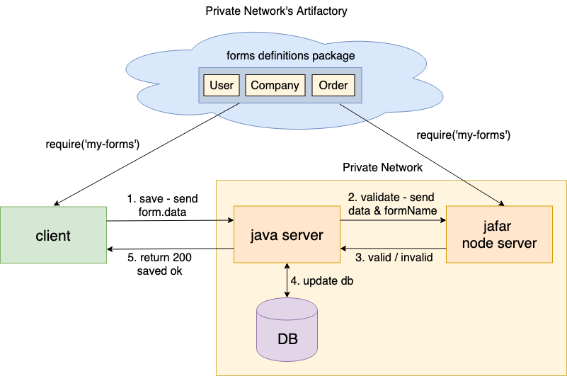

Writing form validations 2 times - both in the client and server can be a huge headache - consuming duplicate type of work and time, usually write them in a different language, and the validations might not be consistence in both sides. 

Jafar allow you to do it only one time in a single place! Using a server Node.js you can expose an endpoint that validates the same form definition that was already defined to the client pages usage. 

Jafar separates the logical form from the ui Form component. The logical form is a pure javascript form
class that can be used both from the Form component (for example `@jafar-org/react-form/Form` component uses it behind the scene)
as well as in a node server. 

By defining a form definition schema in a common package - and use in it both in the client page 
(using Form component that gets that model & resources form definition as a props) as well as in a Node.js server - you reduce work duplication and time, consist all form related in one language support, and keep the validations synced in both client and server.

## Architecture



In the Node.js server - all you need to do to preform server validation is:

1. Expose a POST endpoint for validation - that gets the form's data from the body and the form name as a url parameter
1. Require the javascript Form class from `@jafar-org/form`
1. Require the specific form definition using the formName param from the forms definitions common package
1. Apply the data to the form definition model
1. Initialize the Form class with the model & resources, and await for init to finish
1. Check if the form is valid
1. Return response valid / invalid

## Example - Jafar Node Server

The following example demonstrate a simple Node.js server that validates a specific form with the given data from the client.
Running `node server.js` will start the server and wait for requests.

> **Note:** If a form used [context](context) object to contain dependent app data such as logged-in user data or permissions, you should override
it in the server with the expected data (e.g get the logged-in user data from the server session for example)

### endpoints/validate.js

```javascript
const clone = require('lodash/clone');
const Form = require('@jafar-org/form').default;
const handleError = require('../handle-response').handleError;
const handleSuccess = require('../handle-response').handleSuccess;

const errors = {
  FORM_NAME_PARAM_MISSING:
  'formName was not defined as a url parameter. For example http://localhost:3001/validate?formName=user',
};
/*
 POST
 headers = { 'Content-Type': 'application/json' }
 url = http://localhost:3001/validate?formName=user
 body = { firstName: 'Monica' }
*/
module.exports.validate = async (req, res) => {  
  // get the form param. example: form=user
  let formName = req.url.query.formName;

  if (!formName) {
    return handleError(res, 500, errors.FORM_NAME_PARAM_MISSING);
  }
  
  // get form definition using dynamic require
  let { model, resources } = require(`../forms/${formName}`).default;
  model = clone(model);

  // add data from request body
  model.data = req.body || {};

  // init js-form and wait for init to finish
  const currForm = new Form();
  try {
    await currForm.init(model, resources);
  } catch (e) {
    return handleError(res, 500, e.message);
  }
  
  // check if form is valid
  const invalid = currForm.invalid;
  const result = invalid ? 'false' : 'true';

  // return response
  handleSuccess(res, result);
};
```

### handle-response.js

```javascript
module.exports.handleSuccess = (res, result) => {
  res.statusCode = 200;
  res.setHeader('Content-Type', 'text/plain');
  res.end(result);
};

module.exports.handleError = (res, number, message) => {
  res.statusCode = number;
  res.setHeader('Content-Type', 'text/plain');
  res.end(`Jafar server error: ${message}`);
};
```

### server.js

```javascript
const http = require('http');
const url = require('url');
const handleError = require('./handle-response').handleError;
const validate = require('./endpoints/validate').validate;
const hostname = '127.0.0.1';
const port = 3001;

const supportedMethods = {
  POST: 'POST',
};

const router = {
  '/validate': validate,
};

const handleRequest = (request, response) => {
  const urlData = url.parse(request.url, true);
  const handler = router[urlData.pathname];

  if (!handler) {
    return handleError(response, 404, 'Page not found');
  }
 
  switch (request.method) {
    case supportedMethods.POST: {
      return handlePost(request, response, handler);
    }
    default: {
      return handleError(response, 405, `Method '${request.method}' not allowed`);
    }
  }
};

const handlePost = (request, response, handler) => {
  collectRequestData(request, body => {
    const req = { 
      url: url.parse(request.url, true),
      body,
    };
    handler(req, response);
  });
};

const collectRequestData = (request, callback) => {
  let body = '';
  request.on('data', chunk => {
    body += chunk.toString();

    // if POST data too big, kill the connection.
    // 1e6 === 1 * Math.pow(10, 6) === 1 * 1000000 ~~~ 1MB
    if (body.length > 1e6) {request.connection.destroy();}
  });
  request.on('end', () => {
    callback(JSON.parse(body));
  });
};

const onServerStart = () => {
  console.log(`Jafar server is running at http://${hostname}:${port}`); // eslint-disable-line
};

// create and start server
const server = http.createServer(handleRequest);

server.listen(port, hostname, onServerStart);
```

### forms/user

```javascript
const inputText = require('@jafar-org/react-components/edit/Text').default;

const model = {
  fields = {
    firstName: {
      label: 'First Name',
      description: 'Enter user first name',
      path: 'firstName',
      component': {
        name: 'inputText'
      },
      validators: [
        {
          name: 'uniqueName'
        }
      ]
    }
  },
};

const resources = {
  components: {
    inputText: { renderer: inputText },
  },
  validators = {
    uniqueName: {
      func: props => new Promise((resolve) => {
        setTimeout(() => {
          const allServerNames = ['Rachel', 'Monica'];
          const isNameUnique = !allServerNames.includes(props.value || '');
          resolve(isNameUnique);
        }, 1);
      }),
      message: props => `${props.label} should be unique`,
    },
  },
};

module.exports.default = {
  model,
  resources,
};
```

## Example - Client request

- Method = POST
- Headers = { 'Content-Type': 'application/json' }
- Url = http://localhost:3001/validate?formName=user
- Body =
  1. { firstName: 'Monica' } - Will return invalid - since 'Monica' is already taken and firstName has unique name validation.
  1. { firstName: 'Ross' } - Will return valid.